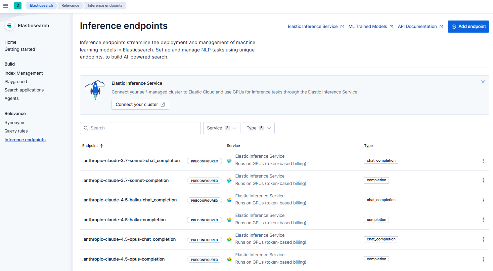

# Elastic Cloud Connect & EIS 活用サンプル

## 概要

本サンプルは、Elastic Cloud Connect と Elastic Inference Service (EIS) を活用し、Self-Managed（オンプレミス等）の Elasticsearch 環境に機械学習モデルを直接インストールすることなく、高度な検索・生成 AI 機能を実装するサンプルプロジェクトです。

## 実現できること

- Embedding: 外部モデルによるベクトル生成とベクトル検索

- Rerank: セマンティックリランクによる検索精度の向上

- Completion: LLM (OpenAI等) を利用した RAG (生成 AI 回答)

## システム構成イメージ

```
[Self-Managed Elasticsearch] <--- Elastic Cloud Connect ---> [Elastic Cloud (EIS)]
```

※Elastic Inference Service (EIS) を経由して、各種マネージドモデルを利用します。

## [!CAUTION]

- 課金に関する注意
  - モデルの使用量に応じて、Elastic Cloud の利用料として別途課金が発生します。検証の際は使い過ぎにご注意ください。

---

## サンプルの内容

本サンプルでは、以下の機能を試すためのスクリプトと環境を提供しています。

- ベクトル検索: Jina-embeddings-v5-text-nano を使用

- ハイブリッド検索 (RRF): キーワード検索とベクトル検索の融合

- セマンティックリランク: Jina-reranker-v3 による高精度な再ランク

- AI 回答生成: OpenAI-gpt-oss-120b-completion (ES|QL) を使用した回答生成

---

## 動作確認環境

- Elastic Cloud: Enterprise License

- Self-Managed Elasticsearch: v9.3.2 (Trial License)

- OS/Tool: Windows 版 Rancher Desktop v1.20.1

- 利用モデル:

  - Jina-embeddings-v5-text-nano

  - Jina-reranker-v3

  - OpenAI-gpt-oss-120b-completion

---

## ディレクトリ構造

| ファイル/フォルダ | 説明 | 備考 |
|---|---|---|
| [docker-compose.yml](./docker-compose.yml) | コンテナ構成定義 | Elasticsearch / Kibana |
| [Dockerfile-es01](./Dockerfile-es01) | ES専用 Dockerfile | icu, kuromoji プラグイン導入済 |
| [.env.sample](./.env.sample) | 環境変数サンプル | .env にコピーして使用 |
| [data/](./data/README.md) | サンプルデータ | 「吾輩は猫である」の NDJSON |
| [es_scripts/](./es_scripts/README.md) | Dev Tools 用スクリプト | インデックス作成、検索クエリ等 |

---

## セットアップ手順

### 1. 環境変数の準備

.env.sample を .env にコピーし、パスワードや暗号化キー、メモリサイズを編集します。

```
cp .env.sample .env
```

- ELASTIC_PASSWORD: 任意のパスワード

- SAVEDOBJECTS_ENCRYPTIONKEY: 32文字以上のランダムな文字列

- ES01_MEM_LIMIT : es01 用に割り当てるメモリサイズ

- KIBANA_MEM_LIMIT : kibana 用に割り当てるメモリサイズ


### 2. コンテナの起動
  
Rancher Desktop 等の Docker ランタイムが起動していることを確認し、以下を実行します。

```
docker-compose up -d --build
```

- ※初回起動時にプラグインのインストールが行われます。

- ※検証用のため、シングルノード構成となっています。

### 3. Elastic Cloud 連携 (Cloud Connect)

#### 3.1. Self-Managed Kibana へのログイン

http://localhost:5601 へアクセスしログインします。

- user: elastic
- password : ELASTIC_PASSWORD に設定したパスワード

#### 3.2. メニュー移動

Home > Management > Cloud Connect をクリック。


#### 3.3. Elastic Cloud へのログイン

画面の指示に従い Elastic Cloud へログインします。


### 3.4. Cloud Connect API Key の取得

画面の指示に従い Cloud Connect API Key を取得します。


#### 3.5. 接続

取得したキーを Self-Managed 側の Kibana にペーストし、[Connect] を実行します。


---

## 実行ガイド

各手順の詳細は、各リンク先の Markdown ファイルを参照してください。

### ステップ 1:データの準備

- 1. データアップロード: [data/README.md](./data/README.md) の手順で waganeko_tmp インデックスを作成します。

- 2. 環境構築: [es_scripts/](./es_scripts/README.md) 内の a2 〜 a5 を順に実行し、インデックス、エイリアス、および Ingest Pipeline を作成します。

- 3. Reindex: [es_scripts/a6_reindex.md](./es_scripts/a6_reindex.md) を実行。

この過程で EIS を通じてベクトルが自動生成され、content_embedding フィールドに格納されます。

### ステップ 2:検索の実行

- 1. キーワード検索: [es_scripts/a7_keyword_search.md](./es_scripts/a7_keyword_search.md)

- 2. ベクトル検索: [es_scripts/a8_vector_search.md](./es_scripts/a8_vector_search.md)

- 3. RRF リランク: [es_scripts/a9_rrf.md](./es_scripts/a9_rrf.md)

- 4. セマンティックリランク: [es_scripts/a10_rrf_semantic_rerank.md](./es_scripts/a10_rrf_semantic_rerank.md)
  - EIS 経由で Jina-reranker-v3 を使用し、文脈に基づいた最適な順位付けを行います。

### ステップ 3:LLMによる回答生成

[es_scripts/a11_completion.md](./es_scripts/a11_completion.md) を実行し、ES|QL の COMPLETION 関数を使用して、検索結果に基づいた自然言語の回答を取得します。

---

## 技術的な補足

### モデル名の指定方法

EIS で利用するモデル名は、Elastic Cloud の Relevance > Inference endpoints 画面に表示される Endpoint ID を使用します。



### RRF とセマンティックリランクの役割

本サンプルでは、RRF とセマンティックリランクを併用しています。

- RRF (Reciprocal Rank Fusion): キーワードとベクトルの異なる検索手法を統合し、候補を漏れなく抽出する「絞り込み」のフェーズ。

- セマンティックリランク: 絞り込まれた上位ドキュメントに対し、LLM 的な文脈理解で「真の回答」を最上位に持ってくる「仕上げ」のフェーズ。

### waganeko_tmp インデックス

waganeko_tmp インデックスの内容を waganeko インデックスへ reindex した後は、waganeko_tmp インデックスは不要となります。

必要なければ、削除してかまいません。

### Cloud Connect の費用

- Cloud Connect を利用した場合の追加費用については、下記を参照してください。
  - https://cloud.elastic.co/cloud-pricing-table?productType=cloud_connect

- 実際にかかった費用は、Elastic Cloud の Billing 画面で確認することができます。


