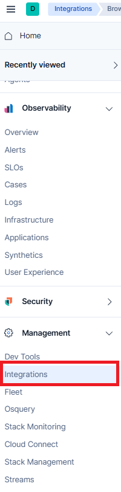
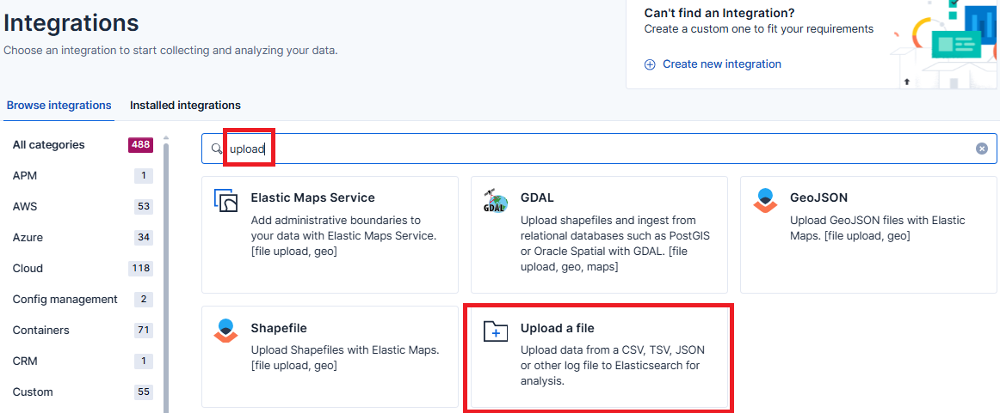
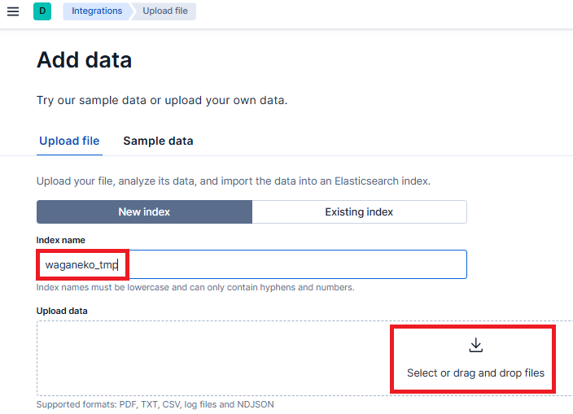
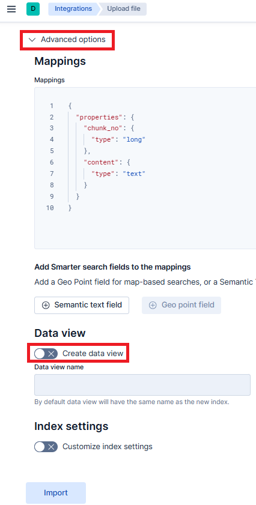
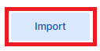

# README.md

no_ruby_wagahai_wa_neko_dearu.ndjson は、
青空文庫からダウンロードした「吾輩は猫である」を ndjson 形式に変換したものです。

https://www.aozora.gr.jp/cards/000148/card789.html

以下の手順で no_ruby_wagahai_wa_neko_dearu.ndjson を waganeko_tmp index へアップロードしてください。

## 1. アップロード手順

### 1.1. Home メニュー

Self-Managed の Elastic Home メニューの Management / Integrations をクリックします。

### 1.2. Integrations 画面

Integrations 画面に切り替わるので、フィルター入力欄に "uplaod" と入力します。

upload を含む Integation のみが表示されるので、Upload a file ボタンをクリックします。

### 1.3. Add data 画面

Add data 画面に切り替わります。

- Index name に、waganeko_tmp と入力します。

- Upload data の欄に ./no_ruby_wagahai_wa_neko_dearu.ndjson ファイルをドラッグ＆ドロップします。

### 1.4. Advanced options

Advanced options を展開します。

- Data view の Create data view を off にします。

### 1.5. Import

Import ボタンをクリックします。

wagenako_tmp インデックスへのアップロードが行われます。
