# AutoOps サンプル

## 概要

https://elastic.sios.jp/category/blog/ で公開予定のブログ
「AutoOps を使ってオンプレミスの Elasticsearch のインデックス情報、メトリクスを Elastic Cloud で監視する」
で使用するサンプルアプリケーションです。

## 実現できること

- オンプレミス環境の Elasticsearch ノードの稼働状態、パフォーマンス、リソース使用率の可視化

- インデックス情報、シャード配置、スレッドプールなどの詳細監視

- Elastic Cloud の管理画面からの統合的なヘルスチェック

## AutoOps とは

Elastic AutoOps は、Elasticsearch クラスターの健全性を維持するための監視・最適化支援ツールです。

参考URL

- https://www.elastic.co/docs/deploy-manage/monitor/autoops
- https://www.elastic.co/jp/blog/autoops-free
- https://www.elastic.co/jp/platform/autoops
- https://www.elastic.co/search-labs/jp/blog/elastic-autoops-self-managed-elasticsearch


## システム構成イメージ

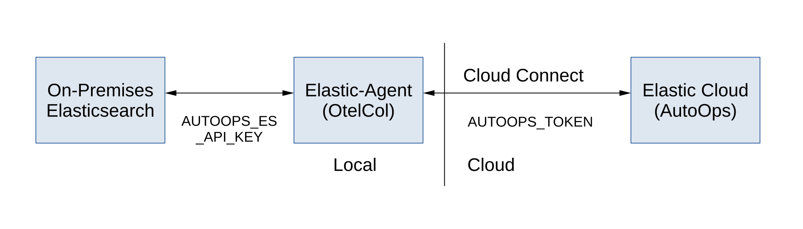

Elastic Agent がオンプレミス環境の Elasticsearch のインデックス情報や、各種メトリクスを取得し、それらを Elastic Cloud へセキュアに送信します。

これにより、外部からセキュアにインデックス情報やCPU使用率などの監視が可能になります。

## サンプルの内容

- Elasticsearch 環境
  - docker-compose.yml, .env.sample
  - オンプレミス Elasticsearch をコンテナとして動作させます。

- AutoOps エージェント環境
  - docker-compose-autoops.yml, Dockerfile-autoops
  - メトリクスを転送するためのエージェントを構成します。

## 動作確認環境

- Elastic Cloud (無償アカウントで利用可能)

- Docker 実行環境  
  - 筆者は Windows 上の Rancher Desktop 1.20.1 で動作確認

- オンプレミス Elasticsearch: v9.3.3 (Basic License)
  - 自動でダウンロードされます。

- AutoOps: v9.3.2
  - 執筆時点で v9.3.3 での動作検証ができなかったため、v9.3.2 を使用しています。
  - 自動でダウンロードされます。

## ファイルの説明

| ファイル | 説明 | 備考 |
|---|---|---|
| [.env.sample](./.env.sample) | 環境変数のテンプレート | .env にコピーして使用 |
| [docker-compose.yml](./docker-compose.yml) | Elasticsearch 本体の構成 | Master : 3 nodes, Data : 2 nodes, Kibana |
| [docker-compose-autoops.yml](./docker-compose-autoops.yml) | AutoOps用エージェントの構成 | |
| [Dockerfile-autoops](./Dockerfile-autoops) | AutoOps用カスタム Dockerfile | |

## セットアップ手順

[!IMPORTANT]
- ※事前に Elastic Cloud のアカウントが必要です。（無償アカウントでも可）

### 1. パスワードなどの設定

.env.sample を .env にコピーし、パスワードや暗号化キー、メモリサイズを編集します。

```
cp .env.sample .env
```

主な設定項目

- CLUSTER_NAME : 監視画面に表示されるクラスタ名

- ELASTIC_PASSWORD : 任意のパスワード

- KIBANA_PASSWORD : 任意のパスワード

- SAVEDOBJECTS_ENCRYPTIONKEY: 32文字以上のランダムな文字列

- MEM_LIMIT : 各コンテナに割り当てるメモリの上限サイズ

### 2. コンテナの起動
  
Rancher Desktop 等の Docker ランタイムが起動していることを確認し、以下を実行します。

```
docker-compose up -d --build
```

しばらく時間がかかります。

### 3. オンプレミス側での API Key の発行

AutoOps から オンプレミス Elasticsearch へ接続するための API Key を発行します。

#### 3.1. オンプレミス Kibana へのログイン

http://localhost:5601 へアクセスしログインします。

- user: elastic
- password : .env ファイルの ELASTIC_PASSWORD に設定したパスワード

### 3.2. API Key の発行

オンプレミス Elastic の Home 画面上で、AutoOps から オンプレミス Elasticsearch へアクセスするための API Key を発行します。

#### 3.3. Home 画面

Home 画面で Elasticsearch を選択します。

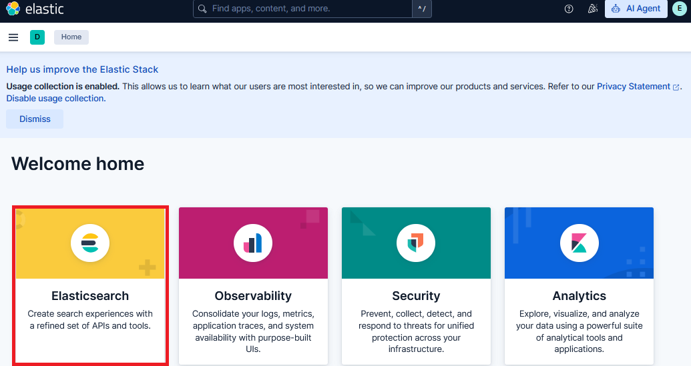

#### 3.4. Welcome 画面

Welcome 画面が表示されるので、右上の \[(+) API keys\] をクリックします。

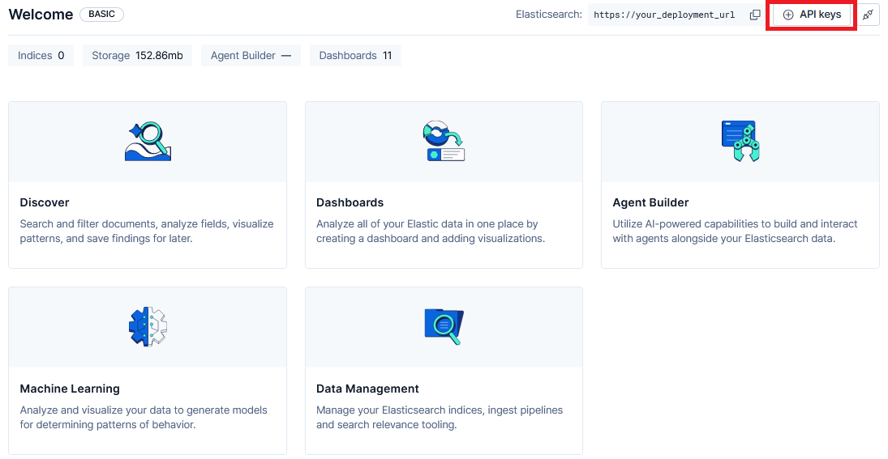

#### 3.5. API Key 作成画面

API Key 作成画面が表示されるので、API key name に autoops_key と入力し、 \[Create API key\] をクリックします。

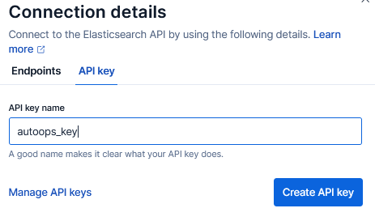

#### 3.6. API Key の貼り付け

生成された API Key が画面に表示されるので、これをコピーして、 .env ファイルの AUTOOPS_ES_API_KEY に貼り付けます。

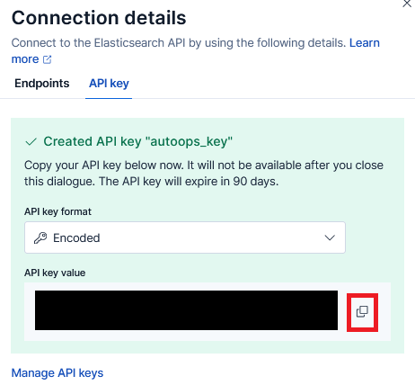

```
AUTOOPS_ES_API_KEY=...
```

### 4. Cloud Connect

オンプレミス Elasticsearch を Elastic Cloud に紐づけます。

#### 4.1. メニュー移動

Home > Management > Cloud Connect をクリック。

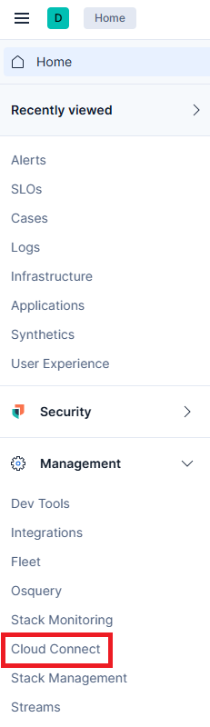

#### 4.2. Elastic Cloud へのログイン

\[Log in\]をクリックします。その後、画面の指示に従い Elastic Cloud へログインします。

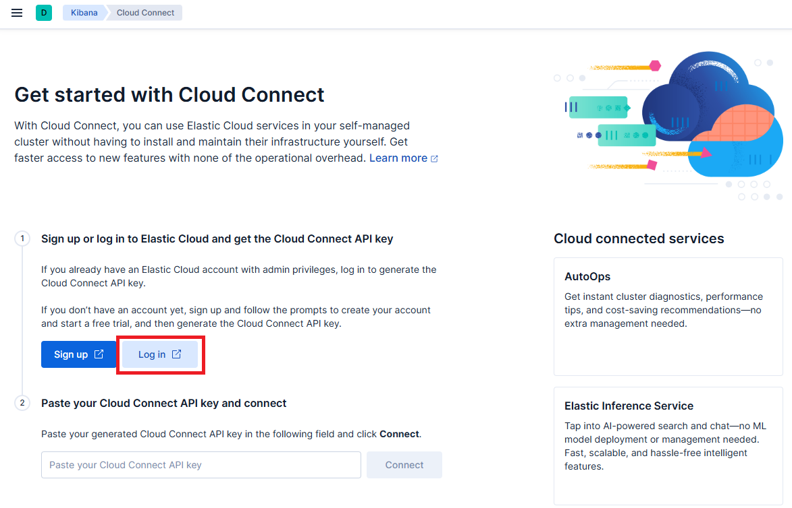

#### 4.3. Cloud Connect API Key の取得

画面の指示に従い Cloud Connect API Key を取得します。

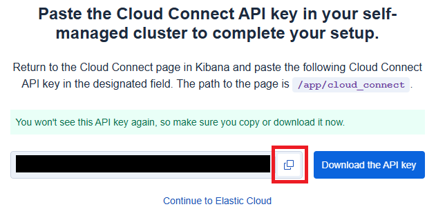

#### 4.4. 接続

取得したキーをオンプレミスの Kibana 上の入力欄にペーストし、\[Connect\] をクリックします。

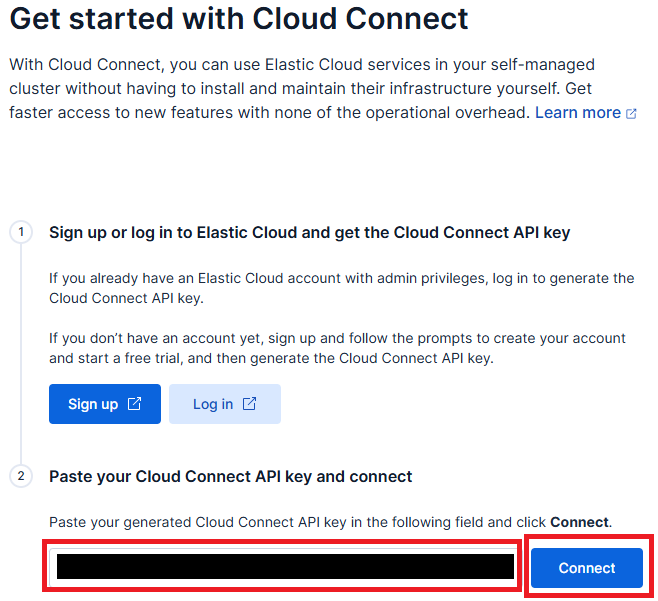


### 5. AutoOps の有効化と接続

#### 5.1. Connect AutoOps

Elastic Cloud 側で操作します。

画面に沿って Connected Clusters の Connect AutoOps 画面へ進みます。

※もしも、次の画面が表示されたら、画面下の Just want AutoOps ? の Get started をクリックしてください。

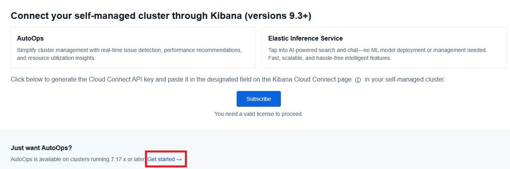


AutoOps Agent のインストールタイプを聞かれますが、今回は Docker を使用しているので、Docker をクリックします。

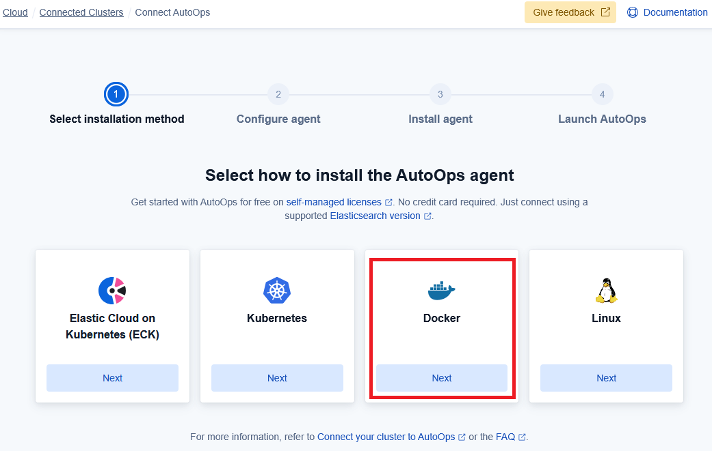


#### 5.2. Configure Docker Agent

AutoOps の設定画面が表示されるので、今回は、Elasticsearch endpoint URL に

```
https://es01:9200
```

を入力します。

authentication method が API key となっていることを確認して、\[Next\]をクリックします。

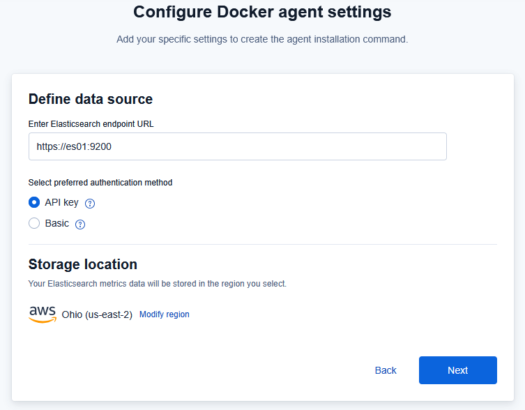


#### 5.3. Docker Compose 用の設定

Docker か Docker Compose かを選択する画面になるので、Docker Compose を選択し、
画面に表示されているコマンドをコピーします。

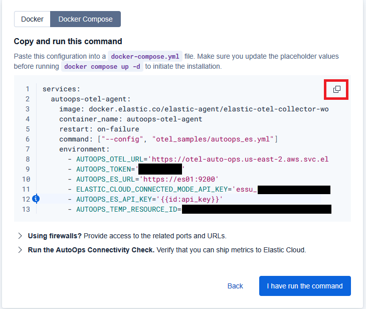

- 本来であれば、これをそのまま動かしたいところなのですが、この画面に表示されている内容だと Elasticsearch の SSL 設定が考慮されていません。
したがって、本サンプルでは SSL に対応した docker-compose-autoops.yml を用意しています。

画面からコピーしたコマンドの内容を元に下記の4つの値を .env ファイルへ転記していきます。

```
AUTOOPS_OTEL_URL=...
...
AUTOOPS_TOKEN=...
...
ELASTIC_CLOUD_CONNECTED_MODE_API_KEY=...
...
AUTOOPS_TEMP_RESOURCE_ID=...
```

※ 値の部分を '...' や "..." で囲む必要はありません。


#### 5.4. AutoOps の Docker コンテナのビルド

```
docker-compose -f ./docker-compose-autoops.yml up -d --build
```

しばらく時間がかかります。

#### 5.5. Elastic Cloud 側での受付開始

コンテナが動き出したら、Elastic Cloud の先ほどの画面の右下の \[I have run the command\] をクリックします。


### 6. AutoOps 画面

しばらくすると、オンプレミス Elasticsearch の各種情報が AutoOps 画面で確認できるようになります。

#### 6.1. Overview

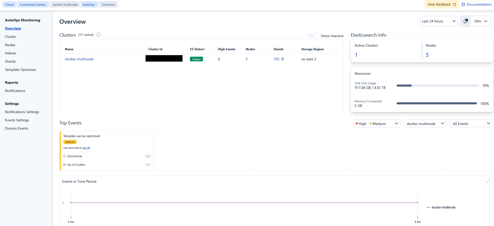

#### 6.2. Cluster

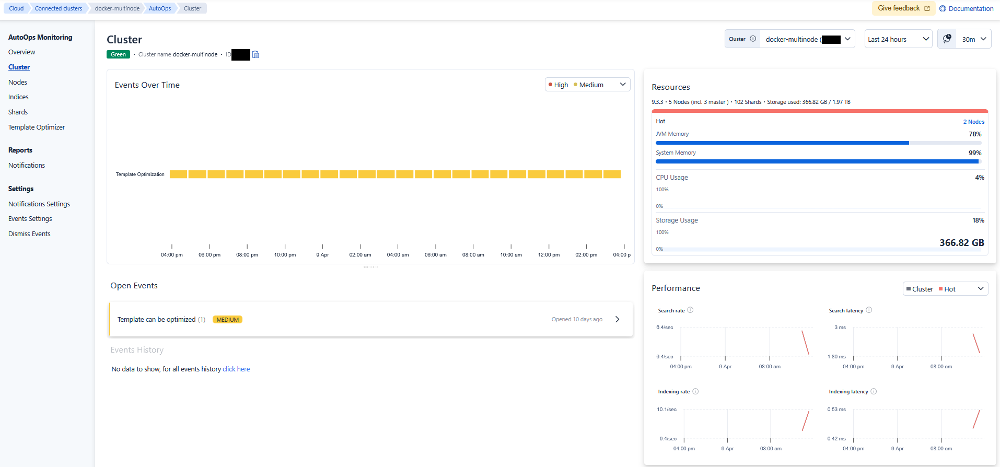

#### 6.3. Nodes

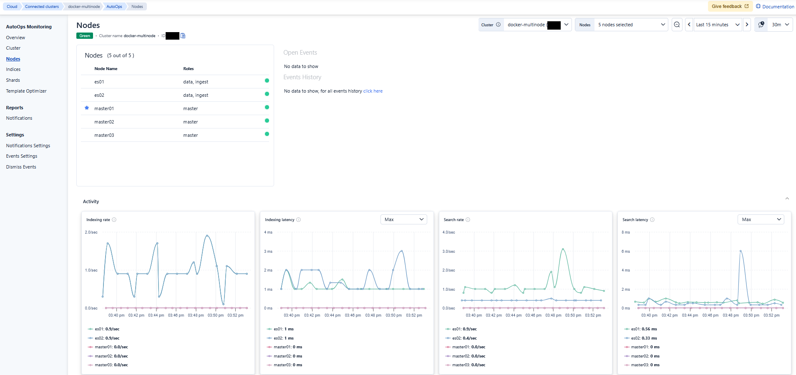

上記は、Nodes の Activity を表示した画面ですが、Activity 以外にも下記を表示することができます。

  - Host and process
  - Thread Pools
  - Data
  - Http
  - Circuit Breakers
  - Network
  - Disk
  - Activity-Additional

#### 6.4. Indices

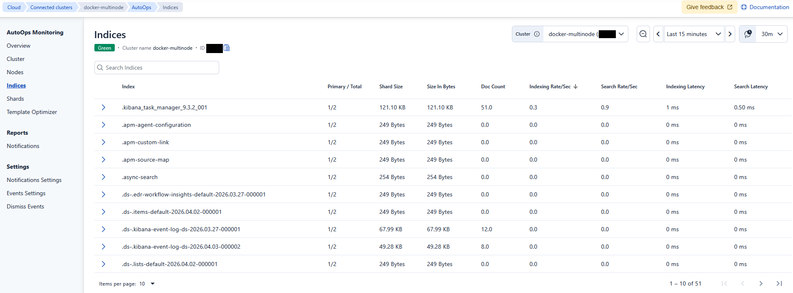

#### 6.5. Shards

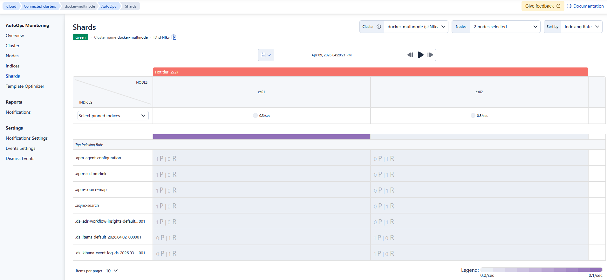

#### 6.6. その他

他にも下記の画面が用意されています。実際に使ってみてください。

- Template Optimizer
- Notifications
- Notifications Settings
- Events Settings
- Dismiss Events

