# Elastic AI Agent を使った簡易RAGアプリケーション

## 概要

2025年1月に公開した White Paper 用のプロジェクト（[簡易RAGアプリケーション](https://github.com/SIOS-Technology-Inc/elastic-white-papers/tree/main/2024-12-simple-rag)）を、Elastic AI Agent 用にリニューアルしたプロジェクトです。

### 主な変更点

| 項目 | 2025-01版 | 2026-09版 |
|---|---|---|
| ベースとなる Elasticsearch のバージョン | v8.16.0 | v9.5.3 |
| index.mode | standard | vectordb_document |
| Machine Learning Node | 必須 | 不要 (代わりにEISを利用) |
| クエリーの言語 | Query DSL | ES\|QL |
| 密ベクトル生成用のモデル | .multilingual-e5-small_linux-x86_64 | .jina-embeddings-v5-text-nano |
| セマンティックリランク用モデル | なし | .jina-reranker-v3.5 |
| 質問回答用LLM | Cohere Command R (2024年12月版) | Anthropic Claude 5 Sonnet (例) |
| UI | Streamlit | Elastic AI Agent |

## できること

Elastic AI Agent を使って、サンプルデータ「柿之助」についての質問に答えてもらうことができます。

※「柿之助」は「桃太郎」を元に改変したお話です（LLMが事前学習していないお話にするため）。

## 動作に必要な環境など

- Elastic Cloud Enterprise License (EIS 用に必要)

- Docker 実行環境 (筆者はWindows用のRancher Desktop 1.24.0を利用)

※Elasticsearch 9.5.3 は、自動的にダウンロードされます。

## シーケンス図（超概略図）

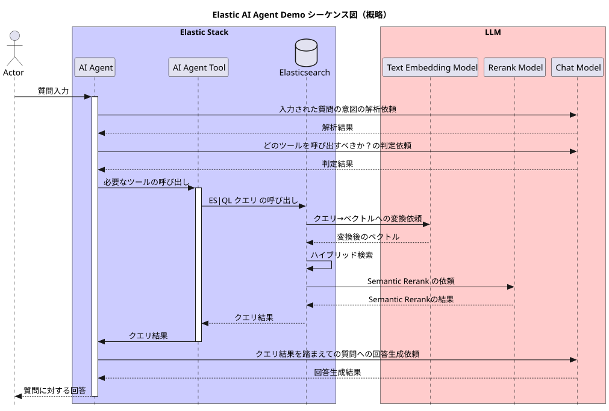

## 動かし方

### 1. 準備

#### 1.1. .env ファイルに動作に必要な情報を記載します。

env.sample.txt ファイルを .env にコピーします。

```
cp env.sample.txt .env
```

.env ファイルを編集します。

```
...
ES_LOCAL_PASSWORD=...
KIBANA_PASSWORD=...
...
SAVEDOBJECTS_ENCRYPTIONKEY=...
...
```

---

### 2. ビルドおよびコンテナの起動

#### 2.1. ビルド

docker-compose.yml があるディレクトリで下記を実行します。

```docker compose build```

#### 2.2. コンテナの起動

```docker compose up -d```

Self-Managed の Elasticsearch および Kibana が起動します。

---

### 3. EIS の設定

http://localhost:5601/ にアクセスし、Kibana にログインします。

https://elastic.sios.jp/blog/vector-search-ai-generated-answers-using-eis/

を参考にして Stack Management / Cloud Connect の設定を行います。

※Self-Managed の Elasticsearch 上で、EIS を経由して、密ベクトル生成用モデル、セマンティックリランク用モデル、問い合わせへの回答用モデルを利用できるようになります。

※別途、利用料金がかかります。

---

### 4. Elasticsearch へのデータ登録

#### 4.1. 密ベクトル生成前のテキストデータの登録

Kibana の Integration / Upload File 機能を使って [data/kakinosuke_chunked.ndjson](./data/kakinosuke_chunked.ndjson) を kakinosuke_tmp インデックスへ登録します。

#### 4.2. インデックスの作成

[es_scripts/01_create_index.md](./es_scripts/01_create_index.md) ファイル内のリクエストを Kibana の Dev Tools から発行し、kakinosuke_202609 インデックスを作成します。

#### 4.3. マッピングの作成

[es_scripts/02_put_mapping.md](./es_scripts/02_put_mapping.md) ファイル内のリクエストを Dev Tools から発行し、kakinosuke_202609 インデックスへ mapping を登録します。

#### 4.4. _reindex

[es_scripts/03_reindex.md](./es_scripts/03_reindex.md) ファイル内のリクエストを Dev Tools から発行し、kakinosuke_tmp インデックス内のドキュメントを kakinosuke_202609 インデックスへコピーします。

このとき、kakinosuke_202609 インデックスには密ベクトルデータや日本語形態素解析用のデータも生成されます。

#### 4.5. キーワード検索

[es_scripts/04_keyword_search.md](./es_scripts/04_keyword_search.md) ファイル内のリクエストを Dev Tools から発行し、kakinosuke_202609 インデックスに対しキーワード検索を行う。

#### 4.6. セマンティック検索

[es_scripts/05_semantic_search.md](./es_scripts/05_semantic_search.md) ファイル内のリクエストを Dev Tools から発行し、kakinosuke_202609 インデックスに対しセマンティック検索を行う。

#### 4.7. ハイブリッド検索

[es_scripts/06_hybrid_search.md](./es_scripts/06_hybrid_search.md) ファイル内のリクエストを Dev Tools から発行し、kakinosuke_202609 インデックスに対しキーワード検索をとセマンティック検索のハイブリッド検索(RRF)を行う。

#### 4.8. セマンティックリランク

[es_scripts/07_semantic_rerank.md](./es_scripts/07_semantic_rerank.md) ファイル内のリクエストを Dev Tools から発行し、kakinosuke_202609 インデックスのハイブリッド検索後の検索結果に対しセマンティックリランクを行う。

---

### 5. AI Agent

#### 5.1. AI Agent の設定

Kibana の Elasticsearch / Agents から Elastic AI Agent 画面へ遷移する。

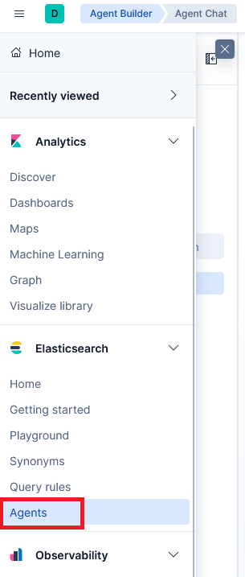

#### 5.2. AI Agent 用の Tool の追加

さきほど作成したセマンティックリランク用のクエリーを AI Agent 用の Tool として追加します。

Elastic AI Agent の下の Tools をクリックします。Tools の画面が表示されるので、右上の \[(+) Add tool\] をクリックします。
さらに Create a tool をクリックします。

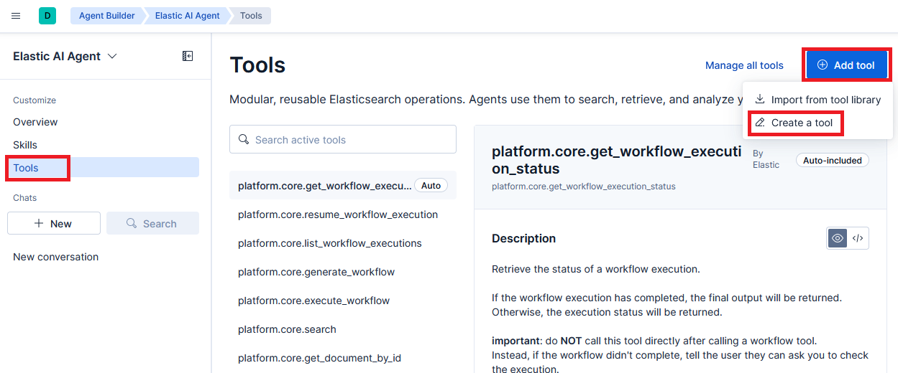

#### 5.3. AI Agent 用の Tool の登録

参考: [es_scripts/08_ai_agent_tool.md](./es_scripts/08_ai_agent_tool.md)

Create new tool 画面が表示されるので、下記のように入力します。入力完了後、右下の \[Save & test\] をクリックします。

##### Type

- Type : ES|QL

- ES|QL Query : 以下のクエリーを入力

（4.8. セマンティックリランク用の ES|QL を AI Agent Tool 用に修正したものです。）

```
FROM kakinosuke_202609* METADATA _score, _id, _index
| FORK (WHERE MATCH(content.semantic, ?query) | SORT _score DESC | LIMIT 10)
       (WHERE MATCH(content, ?query) | SORT _score DESC | LIMIT 10)
| DROP content.semantic
| FUSE
| KEEP chunk_no, content, _score
| SORT _score DESC
| LIMIT 10
| RERANK ?query ON content WITH { "inference_id" : ".jina-reranker-v3.5" }
| KEEP chunk_no, content, _score
| SORT _score DESC
| LIMIT 5
```

- ES|QL Parameters
  <br>Infer parameter をクリックしてから、下記を入力します。

  - Name : query （自動表示されます）

  - Description : 検索したい内容

  - Type : string （自動表示されます）

  - Optional : false

##### Details

- Tool ID : kakinosuke.get_contents

- Description : kakinosuke_202609 インデックスに対して、RRF によるハイブリッド検索を行ったあと、セマンティックリランクを行い、上位5件を返す。

##### Labels

- Labels : kakinosuke

---

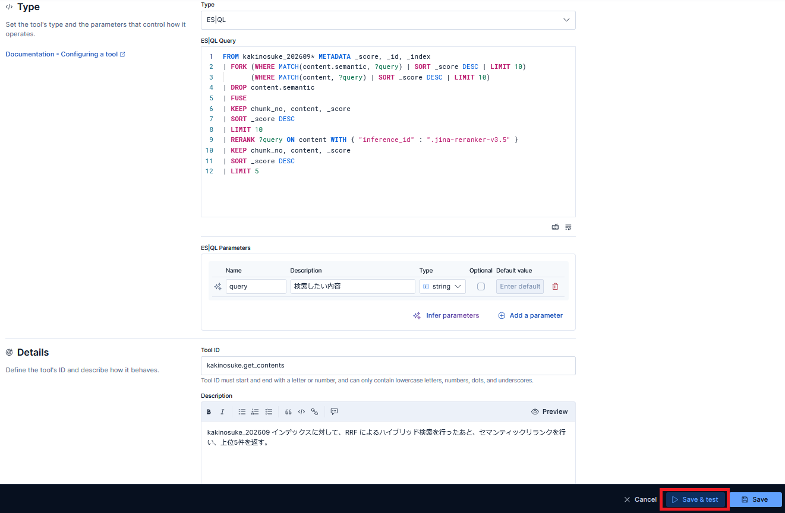

#### 5.4. 保存した AI Agent Tool のテスト

\[Save & test\] をクリックすると、Tool のテスト実行画面が表示されます。

query に、下記を入力した後、\[→ Submit\] をクリックします。

```
柿之助の3人の家来は?
```

Response に5件の結果が表示されることを確認します。

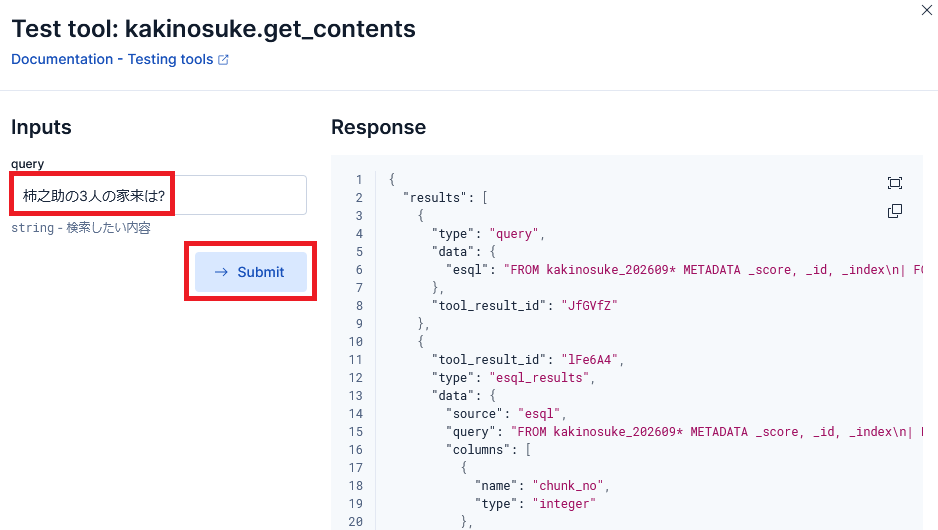

#### 5.5. AI Agent の作成

左上の Elastic AI Agent の \[v] メニューをクリックします。さらに Available agents 一覧の \[+ New agent\] をクリックします。

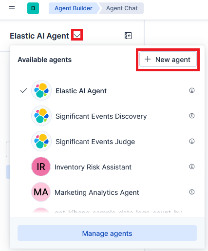

#### 5.6. AI Agent の登録

参考: [es_scripts/09_ai_agent.md](./es_scripts/09_ai_agent.md)

New Agent 画面が表示されるので、以下の内容を登録していきます。

##### Settings タブ

- Agent ID : kakinosuke.agent

- Custom Instructions : 以下を入力します。

```
あなたは kakinosuke_202609 インデックスについての質問に答えるエージェントです。

# 指示1

与えられた質問を query とし、次の tool を呼び出して、結果の 5 件のドキュメントを受け取りなさい。

受け取った5件のドキュメントを指示2に渡しなさい。

- tool : kakinosuke.get_contents

# 指示2

指示1 で取得した 5 件のドキュメントを元に、与えられた質問 (query) に答えなさい。
```

- Enable Elastic capabilities : false

- Labels : kakinosuke

- Access control : Public

- Display name : Kakinosuke Agent

- Display description : 柿之助に関する質問に答える AI Agent です。

- Workflows : なし

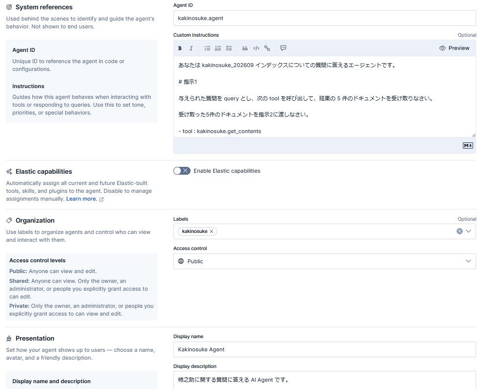

##### Tools タブ

現在チェックされている Tool のチェックを全て外します。

Tool list の右上の Show active only を on にします。

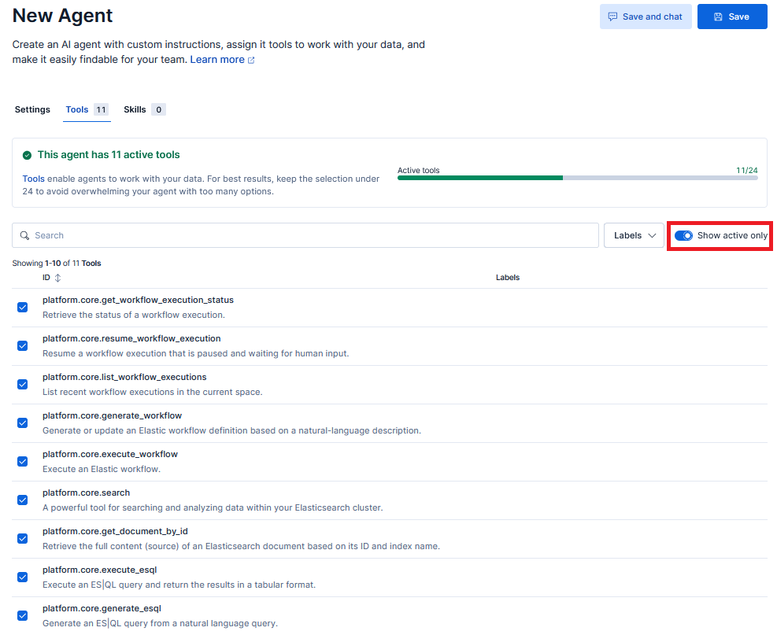

チェックがついている tool を全て off にします。

再度、Show active only を off にしてから、検索欄に "kakinosuke" と入力します。

kakinosuke.get_contents が表示されるので、チェックを入れて、\[Save\] をクリックします。

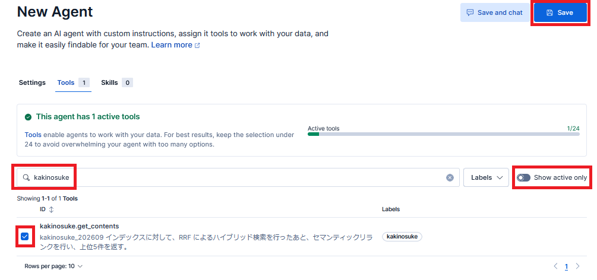

---

#### 5.7. AI Agent の実行準備

Stack Management / Model Management の Feature Settings をクリックします。

Feature settings 画面が表示されるので、Global model から利用したいモデルを選択します。

（モデルの利用料金が別途かかります。）

さらに、今回は、Feature specific models を Disabled にしておきます（全ての AI 機能で Global model を利用します）。

モデルを選択後、右上の \[Save settings\] をクリックします。

（下記は、Anthropic Claude Sonnet 5 を選択した例です。）

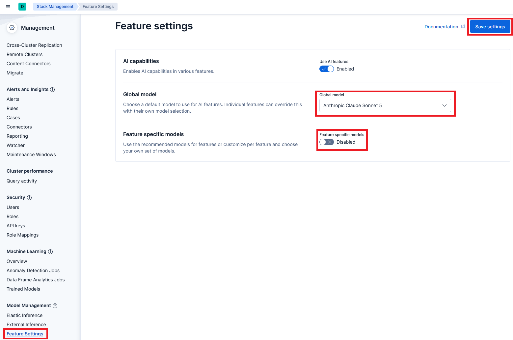

#### 5.8. AI Agent の実行

Home / Elasticsearch / Agents 画面を開きます。

Elastic AI Agent の右の \[v\] をクリックします。Available agents の中から Kakinosuke Agent を選択します。

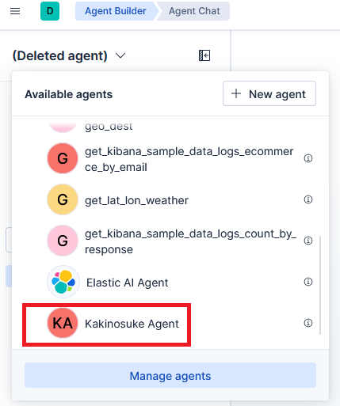

画面中央のプロンプトに次のように入力し、\[↑\] をクリックします。

```
柿之助の3人の家来は?
```

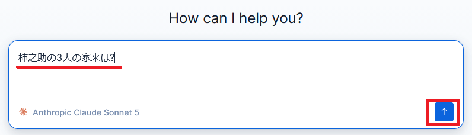

---

しばらく待つと以下のような回答が画面に表示されます。

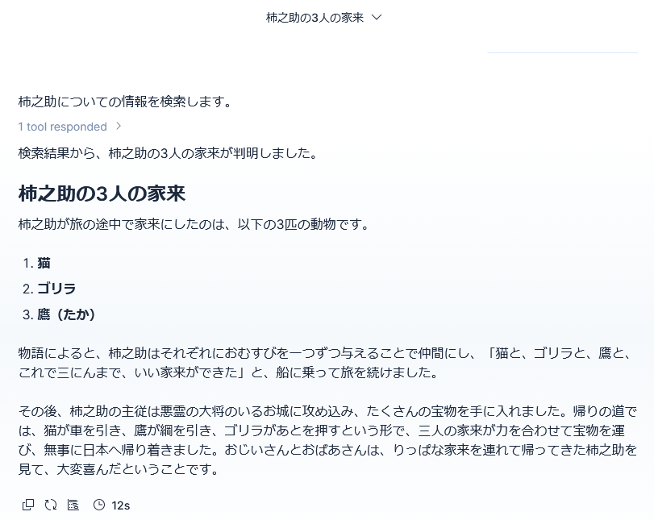

---

回答の下の左から3番目のアイコンをクリックすると、LLM のトレースを表示することができます。

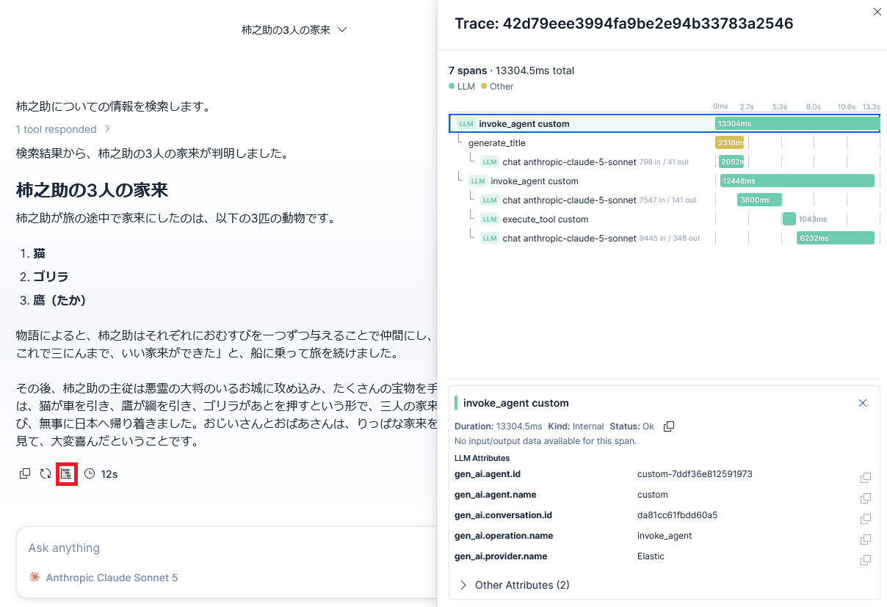

---

この回答の根拠 (reasoning) についても確認することができます。

回答内の 1 tool responded > で閉じられている部分を展開すると、以下のような内容が表示されます。

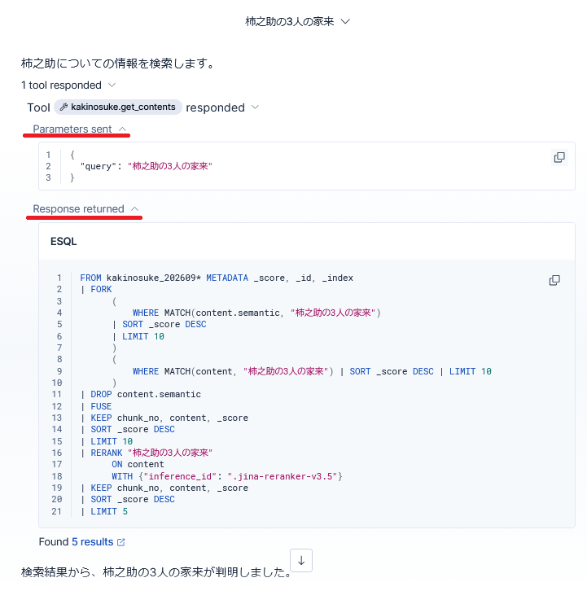

---

Found 5 results のリンクをクリックすると、根拠になった 5 件の結果も表示されます。

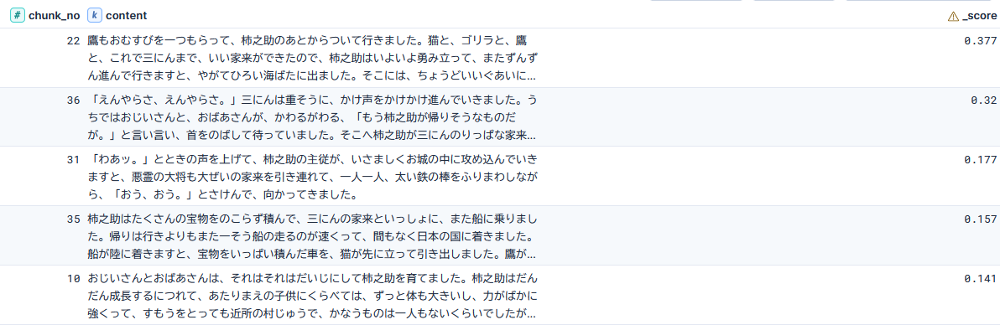

---

### 6. Elastic Agent Tool の呼び出し回数などの集計

Elastic Agent Tool の呼び出し回数、エラー回数、平均処理時間は、以下のクエリーで取得することが可能です。

```
FROM traces-agent_builder.otel-*
| WHERE span.name LIKE "execute_tool *"
| STATS calls = COUNT(*),
        errors = COUNT(*) WHERE status.code == "Error",
        avg_ms = ROUND(AVG(duration) / 1000000.0, 1)
  BY tool = attributes.gen_ai.tool.name
| SORT calls DESC
```

---

## まとめ

v8 のときの Python を使った場合よりも、v9 の Elastic AI Agent を使った方がかなり簡単に RAG を実現できるようになっています。

また、LLM の呼び出し時のトレースや、Reasoning の確認も簡単にできるようになっています。

Elastic AI Agent は、RAG 以外にも利用可能です（Observability や Security での異常発見後の処理など）。

さらに、Elastic Workflows と組み合わせて利用することも可能です。

その他、今回作成した Elastic AI Agent Tool を MCP Client から呼び出す、といったことも可能です。

まずは、一度、Elastic AI Agent を動かしてみて、その良さを体験していただければ、と思います。

---

## 無償トレーニングコースの紹介

2026年9月時点では、Elastic Cloud 上で受講できる AI Agent 関連の無償トレーニングコースに以下のコースが用意されています。

- Platform / Custom agents with Elastic Agent Builder for conversational search

※受講するには、Elastic Cloud へのユーザー登録（無料ユーザーで可）が必要です。

※内容は英語で書かれています。

---

## ファイルの説明

| 相対ファイルパス | 説明 |
|---|---|
| [data/*](./data/README.md) | サンプルデータ「柿之助」の説明 |
| [es_scripts/*.md](./es_scripts/README.md) | Elasticsearch用の各種設定スクリプト |
| [imgs/*](./imgs/) | 説明用の画像ファイル |
| [ai_agent_sequence.puml](./ai_agent_sequence.puml) | シーケンス図の puml ファイル |
| [docker-compose.yml](./docker-compose.yml) | Docker の Compose ファイル |
| [Dockerfile-es01](./Dockerfile-es01) | es01用のDocerfile |
| [env.sample.txt](./env.sample.txt) | 接続に必要なパスワードなどを記載する .env ファイルのひな形 |
| [LICENSE](./LICENSE) | ライセンスファイル |
| [README.md](./README.md) | このファイル |

